# S2P19 个人开发轻量正式运行架构迁移验证

- status: `IMPLEMENTATION_VALIDATED / REAL_PREPARE_NOT_EXECUTED / FORMAL_RUN_NOT_EXECUTED`
- date: `2026-07-29`
- base_commit: `aede7bcc643505fe013f1cd3ea57ad399e2a0a1f`
- plan: `stage_2_plan_v1.9`
- task_contract: `S2P19-T11～T20`
- stage3_locked: `true`

## 原来是什么样子：Plan v1.8

```mermaid
flowchart LR
    A["Source Catalog"] --> B["Input Catalog"]
    B --> C["Adapter Plan"]
    C --> D["Approval Receipt"]
    D --> E["Authority"]
    E --> F["Run"]
    F --> G["每 Task: Catalog + Manifest + Verify + Receipt"]
    G --> H["总 Catalog + 总 Manifest"]
    H --> I["hard-link Candidate Publication"]
    I --> J["总 Verify"]
    J --> K["Publication Receipt"]
```

| 项目 | v1.8 |
|---|---:|
| 操作命令 | 11 个 |
| Run 前正式对象 | 5 类 |
| 每 Task 治理对象 | 4 个，共约 40 个 |
| 最终包装对象 | 5 个 |
| 输出复制 | hard-link 完整候选树 |
| 人工步骤 | 冻结 inputs、adapter、approval、Authority、Run |
| 失败状态 | 分散在多个 schema 和目录 |

## 最后是什么样子：Plan v1.9 Solo Runtime

```mermaid
flowchart LR
    A["prepare"] --> B["inputs.lock.json"]
    B --> C["一次人工批准: commit + inputs_lock_hash"]
    C --> D["run"]
    D --> E["先 fsync run-authority.json"]
    E --> F["再创建 Run"]
    F --> G["events.jsonl 驱动 S2P19-T11–T20"]
    G --> H["Task 输出 + checkpoint"]
    H --> I["final-manifest.json"]
    I --> J["candidates/run_id"]
    J --> K["final-verify.json"]
    K --> L["原子移动 published/ 或 failed/"]
```

| 项目 | v1.9 |
|---|---:|
| 操作命令 | 4 个：`status / prepare / run / resume` |
| Run 前正式对象 | 2 个：inputs lock、Authority |
| 每 Task 治理对象 | 0 个；只保留输出、checkpoint 和 ledger 事件 |
| 最终包装对象 | Manifest、Verify、Report |
| 输出复制 | 无；目录原子移动 |
| 人工步骤 | prepare 后批准一次，然后一键 run |
| 失败状态 | 单一 Hash 链事件账本及失败 Run 目录 |

## 实际压缩量

| 指标 | v1.8 active | v1.9 active | 减少 |
|---|---:|---:|---:|
| 操作命令 | 11 | 4 | 7（63.6%） |
| 运行前对象类型 | 5 | 2 | 3（60.0%） |
| 每 Task 治理对象 | 约 40 | 0 | 约 40（100%） |
| 外层治理 schema | 16 | 7 | 9（56.3%） |
| 当前治理记录 | 18 | 4 | 14（77.8%） |
| 当前运行实现代码 | 2,499 行 | 2,483 行 | 16 行（0.6%） |
| 定向运行时测试代码 | 631 行 | 435 行 | 196 行（31.1%） |
| 实现与定向测试合计 | 3,130 行 | 2,918 行 | 212 行（6.8%） |

“当前治理记录”只统计当前执行所需的 Plan/ADR/Task/Validation/Policy 类记录；v1.8 历史
文件按追溯要求继续留在仓库，因此仓库历史文件总数不会倒退。v1.9 新增的当前治理记录
只有迁移 ADR、Plan、合并 Task 合同和 Policy v8；预注册 binding 是研究配置，不重复
建立 CR/ADR。

实现代码本身只净减少 16 行；这是实际测量，不把格式变化伪装成大幅精简。输入逐分区
审计、事件 Hash 链、失败目录、附录 J Manifest 和完整最终 Verify 都属于保留硬门。
加上去掉的重复对象层测试，当前运行实现与定向测试合计净减少 212 行。主要收益仍来自
运行时对象、命令、人工交接和 schema 数量下降。

## 删除对象清单

从当前主线删除：

- `scripts/run_stage2_v18.py` 的 11 命令入口；
- `scripts/run_stage2_v18_task.py` 独立 Task 进程入口；
- `formal_chain.py` 的独立 approval、adapter plan、per-Task receipt、总 Catalog、
  candidate receipt 和 publication receipt 编排；
- `input_catalog.py` 独立输入 Catalog；
- `production.py` 的每 Task Catalog/Manifest/Verify/Receipt 外壳；
- v1.8 当前 Policy loader。

没有删除：

- Plan v1.7 及更早正式 Run、Manifest、Verify、报告和失败状态；
- v1.8 Plan、ADR、Task 与 Validation 历史合同；它们统一标记
  `SUPERSEDED_UNEXECUTED`；
- T11/T16 数学引擎和性能证据；
- BTC/T2/20bp/25bp、matching、AMBIGUOUS、cluster、seed；
- lifecycle 双轨与 H2 分流。

## 保留硬门

- 完整周期 BTC/ETH 来源审计和逐日 Contract Price 分区 Hash；
- 十二类输入 binding、绝对源路径、防 symlink、防品种混合；
- clean commit 和一次精确 commit/input-lock 人工批准；
- Authority-before-Run、一个 Authority 最多一个 Run、唯一运行锁；
- 固定十 handler registry、DAG、上游完成事件和输出树 Hash 重验；
- append-only attempt/checkpoint，retryable interruption 与 terminal failure 分离；
- 附录 J 全字段、全部尝试、完整输出清单；
- candidate 全量 Hash Verify、Verify FAIL 进入 `failed/`、PASS 原子进入 `published/`；
- historical execution claim 为 false，Stage 3 永远锁定。

## 命令对照

| v1.8 | v1.9 |
|---|---|
| `status` | `status` |
| `freeze-adapter-plan` | 删除；handler registry 由 commit + contract bundle 固定 |
| `freeze-input-catalog` | 合并进 `prepare` |
| `record-approval` | 合并进 `run` 的 Authority |
| `freeze-authority` | 合并进 `run`，且必须先于 Run ID |
| `run` | `run` |
| `resume` | `resume` |
| `reconcile` | `run` 内自动 |
| `publish-candidate` | `run` 内原子移动 |
| `verify` | `run` 内自动完整 Verify |
| `seal-publication` | Verify PASS 后原子移动，不再建 receipt |

## 已验证场景

- 快速十 Task fake chain；
- retryable interruption 新 attempt 恢复，旧 attempt/checkpoint 保留；
- terminal failure 进入 `failed/` 且不可 resume；
- 输入 symlink、输入 Hash 漂移、错误批准 commit/inputs-lock Hash 失败关闭；
- Authority 在无 Run 时幂等，且不产生第二 Authority；
- 上游 Task 输出 Hash 漂移阻断恢复；
- Verify failure 不进入 `published/`；
- 每 Task 不产生 Catalog/Manifest/Verify/Receipt；
- Task 输出中的 Run 内路径在发布前规范化为相对路径；
- 固定真实 registry 恰好绑定 S2P19-T11～T20；
- v1.9 UI 从 inputs lock、Authority、events、checkpoint 和 final Verify 投影完整进度字段。

## 验证命令与结果

- 生命周期、solo runtime、治理和 UI 定向回归：`87 passed`；
- 单进程全仓 pytest：`870 passed in 39.90s`；
- Ruff：`All checks passed`；
- Mypy：`Success: no issues found in 282 source files`；
- strict governance：`PASS`；
- strict traceability：`PASS`（33 rules、41 INV、18 contracts、52 reasons、10 gates）；
- v1.9 `status` 只读入口：`PASS`，未创建任何证据对象。

以上全部是代码与隔离 fixture 验证。没有执行真实 `prepare`，没有创建真实 inputs lock、
Authority、Run、Manifest、Verify 或 publication，也没有进入 Stage 3。
